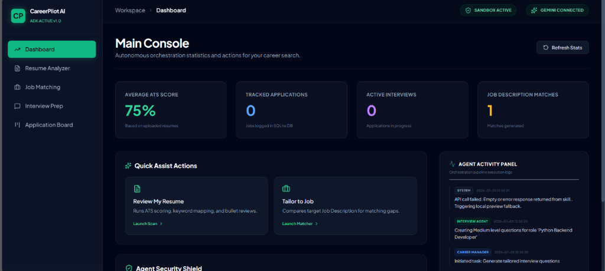

# CareerPilot AI 🚀

### AI-Powered Career Concierge Built with Google ADK & Gemini 2.5

<p align="center">
A production-ready full-stack AI platform that helps students and job seekers optimize resumes, match jobs intelligently, prepare for interviews, and manage their application pipeline—all from a modern web dashboard.
</p>

---

## ✨ Overview

CareerPilot AI combines multiple AI agents into a unified career assistant capable of analyzing resumes, evaluating ATS compatibility, matching candidates with job descriptions, generating personalized learning roadmaps, conducting mock interviews, and tracking job applications in real time.

The platform is designed with a modern React interface, a FastAPI backend, Google Agent Development Kit (ADK), Gemini 2.5, and SQLite for persistent storage.

---

## 📸 Dashboard Preview



---

## ✨ Key Features

* 📄 AI Resume Parsing (PDF & DOCX)
* 🎯 ATS Resume Analysis & Scoring
* ✍️ Resume Bullet Improvement Suggestions
* 🤖 Semantic Job Matching
* 📚 Personalized Skill Gap Analysis & Learning Roadmap
* 💬 AI-Powered Mock Interviews
* ⭐ Interview Evaluation & STAR-Based Feedback
* 📌 Job Application Pipeline Tracker
* 📊 Real-Time Dashboard Analytics
* 🗃 SQLite Database Persistence
* 🔐 Secure File Upload Validation
* ⚡ Google ADK Multi-Agent Orchestration
* 🌙 Premium Glassmorphism UI

---

## 🏗 System Architecture

```text
               React + Tailwind Dashboard
                         │
                         ▼
                 FastAPI REST Backend
                         │
         ┌───────────────┼───────────────┐
         ▼               ▼               ▼
 Resume Agent      Job Match Agent   Interview Agent
         │               │               │
         └───────────────┼───────────────┘
                         ▼
                  Tracker Agent
                         │
                         ▼
                  SQLite Database
```

---

## 🔄 Workflow

1. Upload Resume
2. Resume Agent extracts and analyzes content.
3. ATS score is generated.
4. User pastes a Job Description.
5. Job Match Agent calculates semantic alignment.
6. Skill gaps and learning roadmap are created.
7. Interview Agent generates personalized interview questions.
8. Candidate answers are evaluated.
9. Tracker Agent stores all reports and applications.
10. Dashboard updates automatically.

---

## 🛠 Tech Stack

| Category     | Technologies               |
| ------------ | -------------------------- |
| Frontend     | React, Vite, Tailwind CSS  |
| Backend      | FastAPI                    |
| AI Framework | Google ADK                 |
| LLM          | Gemini 2.5 Flash           |
| Database     | SQLite, SQLAlchemy         |
| File Parsing | MCP Filesystem Server      |
| Language     | Python                     |
| Deployment   | Ready for Cloud Deployment |

---

## 📂 Project Structure

```text
CareerPilot-AI/
│
├── frontend/
├── backend/
├── agents/
├── uploads/
├── assets/
├── database/
├── main.py
├── requirements.txt
├── run.ps1
├── run
└── README.md
```

---

## 🗄 Database

The application stores persistent information in SQLite.

### Tables

* users
* resume_reports
* job_matches
* interview_history
* applications

---

## 🔐 Security

* PDF and DOCX validation
* Maximum upload size protection
* Directory traversal prevention
* Prompt injection isolation
* Structured agent communication
* Audit logging
* Local sandbox execution

---

## 🚀 Getting Started

### Prerequisites

* Python 3.10+
* Node.js (optional for frontend development)
* Gemini API Key

### Configure Environment

Create a `.env` file.

```env
GEMINI_API_KEY=YOUR_API_KEY
GEMINI_MODEL=gemini-2.5-flash
```

### Install Dependencies

```bash
pip install -r requirements.txt
```

### Run

Windows CMD

```cmd
run
```

PowerShell

```powershell
.\run.ps1
```

Python

```bash
python main.py
```

Open

```text
http://localhost:8000
```

---

## 📌 Future Enhancements

* Multi-user authentication
* Email notifications
* Resume version comparison
* Recruiter dashboard
* AI career coach chat
* Calendar integration
* Cloud database support
* Docker deployment
* CI/CD pipeline

---

## 💡 Why This Project?

CareerPilot AI demonstrates modern software engineering practices by combining AI orchestration, full-stack web development, secure file handling, REST APIs, persistent storage, and a responsive user experience into a single production-style application.

---

## 👨‍💻 Author

**Lokesh Alasandi**

If you found this project useful, consider giving it a ⭐ on GitHub.
