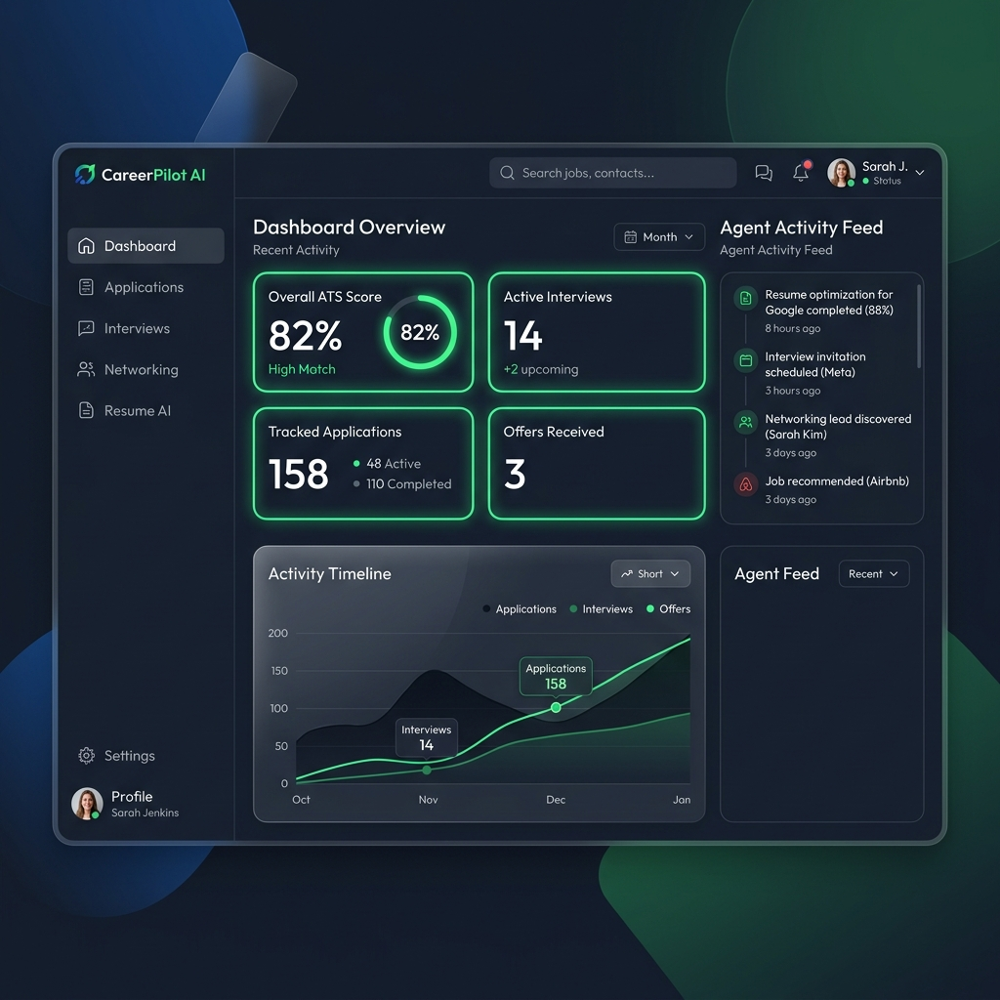

# CareerPilot AI - Premium Full-Stack AI Career Concierge 🚀

CareerPilot AI is a production-quality, secure personal career assistant designed for students and job seekers. Built on the **Google Agent Development Kit (ADK)** and Gemini 2.5, it automates resume parsing, job matching, mock interview preparation, and job application tracking—all inside a modern, glassmorphic SaaS-style web interface.

---

## 🖥️ User Interface Preview

Here is a visual preview of the premium dark-themed CareerPilot AI dashboard, featuring navigation tabs, stats widgets, and the real-time Agent Activity feed:



---

## 🔄 Core Workflows

```
  User Uploads Resume
          │
          ▼
┌───────────────────────────────┐
│     Resume Agent (ADK)        │ ──► ATS Analysis & Score (Persisted in DB)
└───────────────────────────────┘
          │
          ├─────────────────────────────────────────────────┐
          ▼                                                 ▼
┌───────────────────────────────┐                 ┌───────────────────────────────┐
│    Job Match Agent (ADK)      │                 │     Interview Agent (ADK)     │
├───────────────────────────────┤                 ├───────────────────────────────┤
│ • Paste Job Requirements      │                 │ • Generate Role QA            │
│ • Calculate Semantic Score    │                 │ • Submit Answers              │
│ • Map Skill gaps & Roadmap    │                 │ • Grading (Score out of 10)   │
└───────────────────────────────┘                 └───────────────────────────────┘
          │                                                 │
          └────────────────────────┬────────────────────────┘
                                   ▼
                        ┌─────────────────────────┐
                        │   Tracker Agent (ADK)   │
                        ├─────────────────────────┤
                        │ • Log Job Applications  │ ──► Saved to SQLite db
                        │ • Update Status Board   │
                        └─────────────────────────┘
```

1. **ATS Resume Scanner & Bullet Rewrite**:
   - The user uploads a resume file (`.pdf` or `.docx`).
   - The **Resume Agent** parses text securely via MCP, grades overall ATS compatibility, and produces metric-driven bullet-point rewrites.
2. **Semantic Job Alignment & learning Roadmap**:
   - The user pastes target job requirements.
   - The **Job Match Agent** performs semantic comparisons, identifies missing skills (gaps), and drafts a customized learning path.
3. **Role-Specific Mock Interview prep**:
   - The **Interview Agent** designs custom questions matching the candidate's resume and target role difficulty.
   - It grades responses out of 10 and gives feedback mapped to the STAR method structure.
4. **SQLite Pipeline Tracker**:
   - The **Tracker Agent** updates application statuses, logs deadlines, and syncs dashboard statistics in real time.

---

## 🏗️ System Architecture

CareerPilot AI is built as a single-port full-stack web application:
- **Frontend**: Vite + React + TailwindCSS (Compiled static assets served at the root).
- **Backend**: FastAPI REST API + SQLite (SQLAlchemy) + Google ADK Orchestration.
- **MCP filesystem Server**: Stdio-based subprocess verifying sandbox boundaries.

---

## 🗄️ Database Schemas (SQLite)

- **`users`**: Profiles (Guest candidate default).
- **`applications`**: Job applications pipeline (Company, Role, Status, Salary, Deadline, Notes).
- **`interview_history`**: Past generated questions, candidate answers, scores (1-10), and feedback.
- **`resume_reports`**: ATS scanner history, scores, and markdown suggestions.
- **`job_matches`**: Job alignments, scores, roadmaps, and tailored summaries.

---

## 🔒 Security Architectures

1. **Document Sandbox**: Extracted files are checked for type (`.pdf` and `.docx` only), size (<5MB), and normalized strictly within the local `uploads/` folder to prevent directory traversal.
2. **Anti-Injection parameters**: Inputs are passed using structured parameters, isolating resume text from agent persona instructions.
3. **Audit Log Feed**: Displays the real-time agent orchestration workflow inside the UI's **Agent Activity Panel**.

---

## 🚀 How to Run Locally

### 1. Prerequisites
- Python 3.10+ installed.
- Node.js & npm installed (Optional, only needed if modifying frontend code).
- A valid **Gemini API Key** from [Google AI Studio](https://aistudio.google.com/).

### 2. Environment Configuration
Create a `.env` file at the root:
```env
GEMINI_API_KEY=your_gemini_api_key_here
GEMINI_MODEL=gemini-2.5-flash
```

### 3. Start the Web Server
Execute our pre-mapped executable scripts or python launcher directly:

- **Using Command Prompt (`cmd`):**
  ```cmd
  run
  ```
- **Using PowerShell:**
  ```powershell
  .\run.ps1
  ```
- **Using Python directly:**
  ```bash
  python main.py
  ```

This initializes the database, creates all schemas, mounts the React dashboard, and launches the web platform.
👉 Open your browser to: **[http://localhost:8000](http://localhost:8000)**
